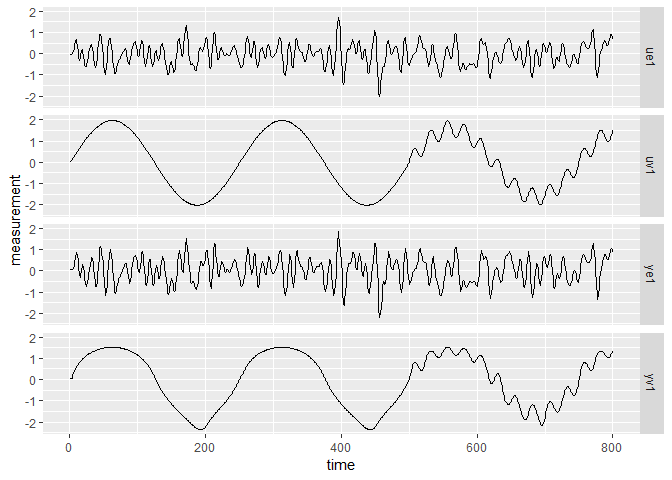
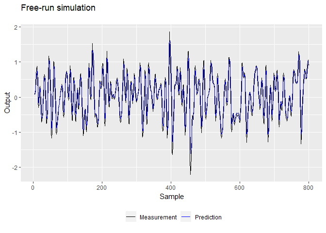
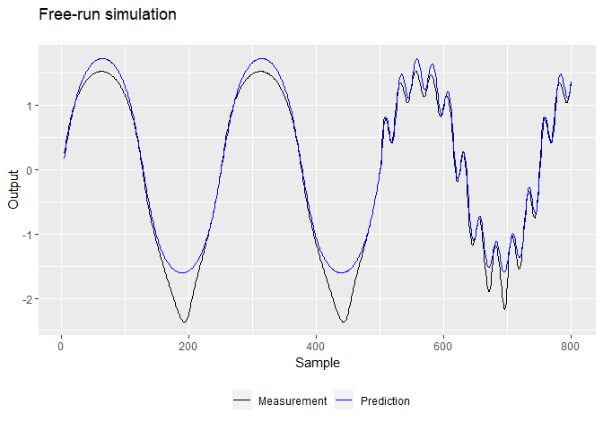
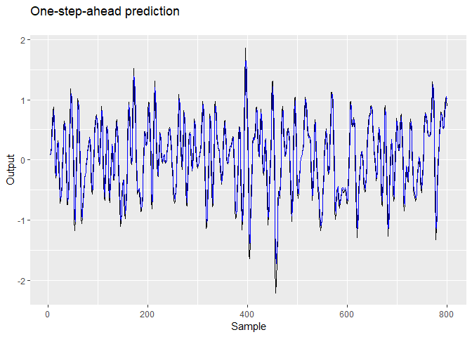
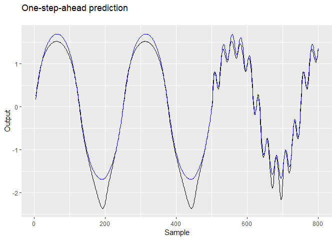
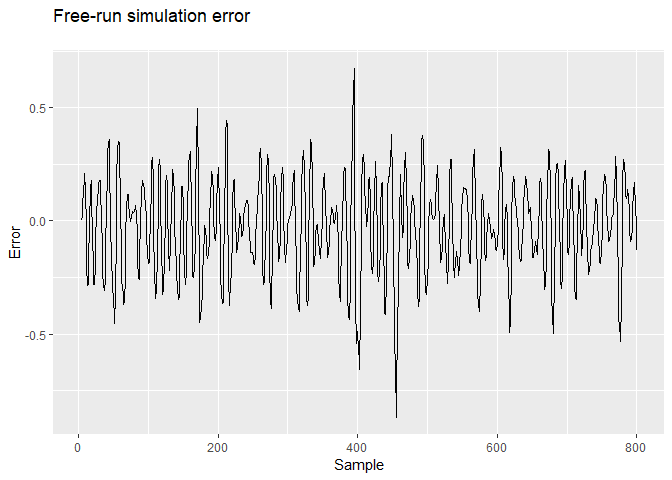
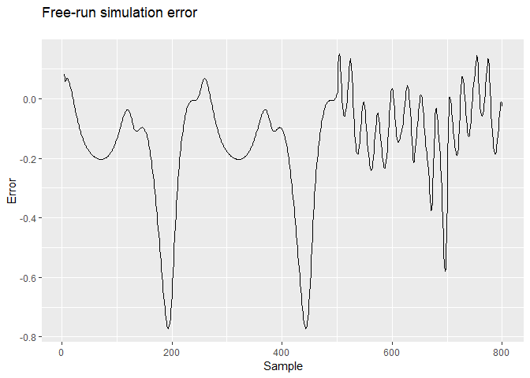
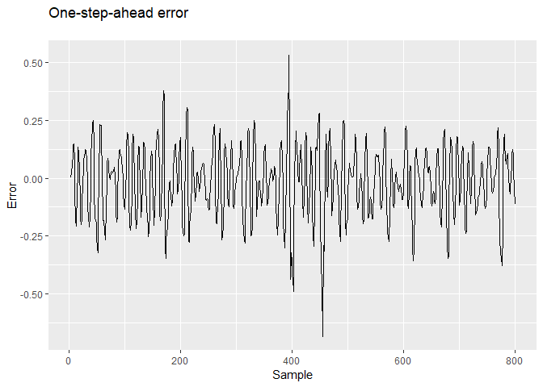
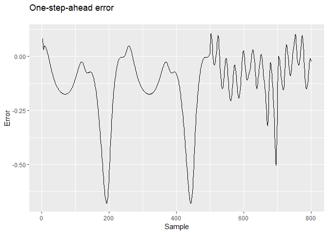

ANN-keras system identification example
================
Hultmann Ayala, Helon Vicente
2018-10-11

Load libraries

``` r
library(narmax)
library(tidyverse)
set.seed(0) 
```

Read system data (see Example 4 (p. 16) in <https://ieeexplore.ieee.org/stamp/stamp.jsp?arnumber=80202> )

``` r
load("../examples/narendra.RData")
ne = length(ue) # amount of data - estimation
nv = length(uv) # amount of data - validation

# normalize data: mean = 0, sd = 1
y = scale(c(ye,yv))
u = scale(c(ue,uv))
ye1 = y[1:800]
yv1 = y[801:1600]
ue1 = u[1:800]
uv1 = u[801:1600]
```

Plot system's input-output data

``` r
df = data.frame(time=1:ne,ye1,ue1,yv1,uv1) %>% gather(variable, measurement, -time)

ggplot(df) + geom_line(aes(x=time,y = measurement)) + facet_grid(variable ~.)
```



Define the parameters of the model

``` r
# select model orders
oy = 1:3
ou = 1:2

# model parameters
nrn = c(128,128,128,128)
#acf = "tanh"
acf = "sigmoid"
mdl = ann(oy,ou,nrn,acf) # create model variable
```

Estimate the parameters of the model

``` r
mdl = estimate(mdl,ye1,ue1,lr = 1e-4, epochs = 200, batch_size = 128, verbose = 0)
print(mdl$mdl)
```

    ## Model
    ## ___________________________________________________________________________
    ## Layer (type)                     Output Shape                  Param #     
    ## ===========================================================================
    ## hidden_layer_1 (Dense)           (None, 128)                   768         
    ## ___________________________________________________________________________
    ## hidden_layer_2 (Dense)           (None, 128)                   16512       
    ## ___________________________________________________________________________
    ## hidden_layer_3 (Dense)           (None, 128)                   16512       
    ## ___________________________________________________________________________
    ## hidden_layer_4 (Dense)           (None, 128)                   16512       
    ## ___________________________________________________________________________
    ## output_layer (Dense)             (None, 1)                     129         
    ## ===========================================================================
    ## Total params: 50,433
    ## Trainable params: 50,433
    ## Non-trainable params: 0
    ## ___________________________________________________________________________

Calculate the predictions of the model in OSA and FR

``` r
# PREDICTIONS - estimation phase
yhe_1 = predict(mdl,ye1,ue1,K = 1) # one-step-ahead
```

    ## Running ann prediction ... Done

``` r
yhe_0 = predict(mdl,ye1,ue1,K = 0) # free-run
```

    ## Running ann prediction ...

    ## [=>----------------------------------------------------------------] 3%
    ## [=>----------------------------------------------------------------] 4%
    ## [==>---------------------------------------------------------------] 4%
    ## [==>---------------------------------------------------------------] 5%
    ## [===>--------------------------------------------------------------] 5%
    ## [===>--------------------------------------------------------------] 6%
    ## [===>--------------------------------------------------------------] 7%
    ## [====>-------------------------------------------------------------] 7%
    ## [====>-------------------------------------------------------------] 8%
    ## [=====>------------------------------------------------------------] 8%
    ## [=====>------------------------------------------------------------] 9%
    ## [=====>------------------------------------------------------------] 10%
    ## [======>-----------------------------------------------------------] 10%
    ## [======>-----------------------------------------------------------] 11%
    ## [=======>----------------------------------------------------------] 11%
    ## [=======>----------------------------------------------------------] 12%
    ## [=======>----------------------------------------------------------] 13%
    ## [========>---------------------------------------------------------] 13%
    ## [========>---------------------------------------------------------] 14%
    ## [=========>--------------------------------------------------------] 14%
    ## [=========>--------------------------------------------------------] 15%
    ## [=========>--------------------------------------------------------] 16%
    ## [==========>-------------------------------------------------------] 16%
    ## [==========>-------------------------------------------------------] 17%
    ## [===========>------------------------------------------------------] 17%
    ## [===========>------------------------------------------------------] 18%
    ## [===========>------------------------------------------------------] 19%
    ## [============>-----------------------------------------------------] 19%
    ## [============>-----------------------------------------------------] 20%
    ## [=============>----------------------------------------------------] 21%
    ## [=============>----------------------------------------------------] 22%
    ## [==============>---------------------------------------------------] 22%
    ## [==============>---------------------------------------------------] 23%
    ## [===============>--------------------------------------------------] 24%
    ## [===============>--------------------------------------------------] 25%
    ## [================>-------------------------------------------------] 25%
    ## [================>-------------------------------------------------] 26%
    ## [=================>------------------------------------------------] 27%
    ## [=================>------------------------------------------------] 28%
    ## [==================>-----------------------------------------------] 28%
    ## [==================>-----------------------------------------------] 29%
    ## [===================>----------------------------------------------] 30%
    ## [===================>----------------------------------------------] 31%
    ## [====================>---------------------------------------------] 31%
    ## [====================>---------------------------------------------] 32%
    ## [=====================>--------------------------------------------] 33%
    ## [=====================>--------------------------------------------] 34%
    ## [======================>-------------------------------------------] 34%
    ## [======================>-------------------------------------------] 35%
    ## [======================>-------------------------------------------] 36%
    ## [=======================>------------------------------------------] 36%
    ## [=======================>------------------------------------------] 37%
    ## [========================>-----------------------------------------] 37%
    ## [========================>-----------------------------------------] 38%
    ## [========================>-----------------------------------------] 39%
    ## [=========================>----------------------------------------] 39%
    ## [=========================>----------------------------------------] 40%
    ## [==========================>---------------------------------------] 40%
    ## [==========================>---------------------------------------] 41%
    ## [==========================>---------------------------------------] 42%
    ## [===========================>--------------------------------------] 42%
    ## [===========================>--------------------------------------] 43%
    ## [============================>-------------------------------------] 43%
    ## [============================>-------------------------------------] 44%
    ## [============================>-------------------------------------] 45%
    ## [=============================>------------------------------------] 45%
    ## [=============================>------------------------------------] 46%
    ## [==============================>-----------------------------------] 46%
    ## [==============================>-----------------------------------] 47%
    ## [==============================>-----------------------------------] 48%
    ## [===============================>----------------------------------] 48%
    ## [===============================>----------------------------------] 49%
    ## [================================>---------------------------------] 49%
    ## [================================>---------------------------------] 50%
    ## [================================>---------------------------------] 51%
    ## [=================================>--------------------------------] 51%
    ## [=================================>--------------------------------] 52%
    ## [==================================>-------------------------------] 52%
    ## [==================================>-------------------------------] 53%
    ## [==================================>-------------------------------] 54%
    ## [===================================>------------------------------] 54%
    ## [===================================>------------------------------] 55%
    ## [====================================>-----------------------------] 55%
    ## [====================================>-----------------------------] 56%
    ## [====================================>-----------------------------] 57%
    ## [=====================================>----------------------------] 57%
    ## [=====================================>----------------------------] 58%
    ## [======================================>---------------------------] 58%
    ## [======================================>---------------------------] 59%
    ## [======================================>---------------------------] 60%
    ## [=======================================>--------------------------] 60%
    ## [=======================================>--------------------------] 61%
    ## [========================================>-------------------------] 61%
    ## [========================================>-------------------------] 62%
    ## [========================================>-------------------------] 63%
    ## [=========================================>------------------------] 63%
    ## [=========================================>------------------------] 64%
    ## [==========================================>-----------------------] 64%
    ## [==========================================>-----------------------] 65%
    ## [==========================================>-----------------------] 66%
    ## [===========================================>----------------------] 66%
    ## [===========================================>----------------------] 67%
    ## [============================================>---------------------] 68%
    ## [============================================>---------------------] 69%
    ## [=============================================>--------------------] 69%
    ## [=============================================>--------------------] 70%
    ## [==============================================>-------------------] 71%
    ## [==============================================>-------------------] 72%
    ## [===============================================>------------------] 72%
    ## [===============================================>------------------] 73%
    ## [================================================>-----------------] 74%
    ## [================================================>-----------------] 75%
    ## [=================================================>----------------] 75%
    ## [=================================================>----------------] 76%
    ## [==================================================>---------------] 77%
    ## [==================================================>---------------] 78%
    ## [===================================================>--------------] 78%
    ## [===================================================>--------------] 79%
    ## [====================================================>-------------] 80%
    ## [====================================================>-------------] 81%
    ## [=====================================================>------------] 81%
    ## [=====================================================>------------] 82%
    ## [=====================================================>------------] 83%
    ## [======================================================>-----------] 83%
    ## [======================================================>-----------] 84%
    ## [=======================================================>----------] 84%
    ## [=======================================================>----------] 85%
    ## [=======================================================>----------] 86%
    ## [========================================================>---------] 86%
    ## [========================================================>---------] 87%
    ## [=========================================================>--------] 87%
    ## [=========================================================>--------] 88%
    ## [=========================================================>--------] 89%
    ## [==========================================================>-------] 89%
    ## [==========================================================>-------] 90%
    ## [===========================================================>------] 90%
    ## [===========================================================>------] 91%
    ## [===========================================================>------] 92%
    ## [============================================================>-----] 92%
    ## [============================================================>-----] 93%
    ## [=============================================================>----] 93%
    ## [=============================================================>----] 94%
    ## [=============================================================>----] 95%
    ## [==============================================================>---] 95%
    ## [==============================================================>---] 96%
    ## [===============================================================>--] 96%
    ## [===============================================================>--] 97%
    ## [===============================================================>--] 98%
    ## [================================================================>-] 98%
    ## [================================================================>-] 99%
    ## [=================================================================>] 99%
    ## [=================================================================>] 100%
    ## [==================================================================] 100%

    ## Done

``` r
# PREDICTIONS - validation phase
yhv_1 = predict(mdl,yv1,uv1,K = 1) # one-step-ahead
```

    ## Running ann prediction ... Done

``` r
yhv_0 = predict(mdl,yv1,uv1,K = 0) # free-run
```

    ## Running ann prediction ...

    ## [=>----------------------------------------------------------------] 3%
    ## [=>----------------------------------------------------------------] 4%
    ## [==>---------------------------------------------------------------] 4%
    ## [==>---------------------------------------------------------------] 5%
    ## [===>--------------------------------------------------------------] 5%
    ## [===>--------------------------------------------------------------] 6%
    ## [===>--------------------------------------------------------------] 7%
    ## [====>-------------------------------------------------------------] 7%
    ## [====>-------------------------------------------------------------] 8%
    ## [=====>------------------------------------------------------------] 8%
    ## [=====>------------------------------------------------------------] 9%
    ## [=====>------------------------------------------------------------] 10%
    ## [======>-----------------------------------------------------------] 10%
    ## [======>-----------------------------------------------------------] 11%
    ## [=======>----------------------------------------------------------] 11%
    ## [=======>----------------------------------------------------------] 12%
    ## [=======>----------------------------------------------------------] 13%
    ## [========>---------------------------------------------------------] 13%
    ## [========>---------------------------------------------------------] 14%
    ## [=========>--------------------------------------------------------] 14%
    ## [=========>--------------------------------------------------------] 15%
    ## [=========>--------------------------------------------------------] 16%
    ## [==========>-------------------------------------------------------] 16%
    ## [==========>-------------------------------------------------------] 17%
    ## [===========>------------------------------------------------------] 17%
    ## [===========>------------------------------------------------------] 18%
    ## [===========>------------------------------------------------------] 19%
    ## [============>-----------------------------------------------------] 19%
    ## [============>-----------------------------------------------------] 20%
    ## [=============>----------------------------------------------------] 21%
    ## [=============>----------------------------------------------------] 22%
    ## [==============>---------------------------------------------------] 22%
    ## [==============>---------------------------------------------------] 23%
    ## [===============>--------------------------------------------------] 24%
    ## [===============>--------------------------------------------------] 25%
    ## [================>-------------------------------------------------] 25%
    ## [================>-------------------------------------------------] 26%
    ## [=================>------------------------------------------------] 27%
    ## [=================>------------------------------------------------] 28%
    ## [==================>-----------------------------------------------] 28%
    ## [==================>-----------------------------------------------] 29%
    ## [===================>----------------------------------------------] 30%
    ## [===================>----------------------------------------------] 31%
    ## [====================>---------------------------------------------] 31%
    ## [====================>---------------------------------------------] 32%
    ## [=====================>--------------------------------------------] 33%
    ## [=====================>--------------------------------------------] 34%
    ## [======================>-------------------------------------------] 34%
    ## [======================>-------------------------------------------] 35%
    ## [======================>-------------------------------------------] 36%
    ## [=======================>------------------------------------------] 36%
    ## [=======================>------------------------------------------] 37%
    ## [========================>-----------------------------------------] 37%
    ## [========================>-----------------------------------------] 38%
    ## [========================>-----------------------------------------] 39%
    ## [=========================>----------------------------------------] 39%
    ## [=========================>----------------------------------------] 40%
    ## [==========================>---------------------------------------] 40%
    ## [==========================>---------------------------------------] 41%
    ## [==========================>---------------------------------------] 42%
    ## [===========================>--------------------------------------] 42%
    ## [===========================>--------------------------------------] 43%
    ## [============================>-------------------------------------] 43%
    ## [============================>-------------------------------------] 44%
    ## [============================>-------------------------------------] 45%
    ## [=============================>------------------------------------] 45%
    ## [=============================>------------------------------------] 46%
    ## [==============================>-----------------------------------] 46%
    ## [==============================>-----------------------------------] 47%
    ## [==============================>-----------------------------------] 48%
    ## [===============================>----------------------------------] 48%
    ## [===============================>----------------------------------] 49%
    ## [================================>---------------------------------] 49%
    ## [================================>---------------------------------] 50%
    ## [================================>---------------------------------] 51%
    ## [=================================>--------------------------------] 51%
    ## [=================================>--------------------------------] 52%
    ## [==================================>-------------------------------] 52%
    ## [==================================>-------------------------------] 53%
    ## [==================================>-------------------------------] 54%
    ## [===================================>------------------------------] 54%
    ## [===================================>------------------------------] 55%
    ## [====================================>-----------------------------] 55%
    ## [====================================>-----------------------------] 56%
    ## [====================================>-----------------------------] 57%
    ## [=====================================>----------------------------] 57%
    ## [=====================================>----------------------------] 58%
    ## [======================================>---------------------------] 58%
    ## [======================================>---------------------------] 59%
    ## [======================================>---------------------------] 60%
    ## [=======================================>--------------------------] 60%
    ## [=======================================>--------------------------] 61%
    ## [========================================>-------------------------] 61%
    ## [========================================>-------------------------] 62%
    ## [========================================>-------------------------] 63%
    ## [=========================================>------------------------] 63%
    ## [=========================================>------------------------] 64%
    ## [==========================================>-----------------------] 64%
    ## [==========================================>-----------------------] 65%
    ## [==========================================>-----------------------] 66%
    ## [===========================================>----------------------] 66%
    ## [===========================================>----------------------] 67%
    ## [============================================>---------------------] 68%
    ## [============================================>---------------------] 69%
    ## [=============================================>--------------------] 69%
    ## [=============================================>--------------------] 70%
    ## [==============================================>-------------------] 71%
    ## [==============================================>-------------------] 72%
    ## [===============================================>------------------] 72%
    ## [===============================================>------------------] 73%
    ## [================================================>-----------------] 74%
    ## [================================================>-----------------] 75%
    ## [=================================================>----------------] 75%
    ## [=================================================>----------------] 76%
    ## [==================================================>---------------] 77%
    ## [==================================================>---------------] 78%
    ## [===================================================>--------------] 78%
    ## [===================================================>--------------] 79%
    ## [====================================================>-------------] 80%
    ## [====================================================>-------------] 81%
    ## [=====================================================>------------] 81%
    ## [=====================================================>------------] 82%
    ## [=====================================================>------------] 83%
    ## [======================================================>-----------] 83%
    ## [======================================================>-----------] 84%
    ## [=======================================================>----------] 84%
    ## [=======================================================>----------] 85%
    ## [=======================================================>----------] 86%
    ## [========================================================>---------] 86%
    ## [========================================================>---------] 87%
    ## [=========================================================>--------] 87%
    ## [=========================================================>--------] 88%
    ## [=========================================================>--------] 89%
    ## [==========================================================>-------] 89%
    ## [==========================================================>-------] 90%
    ## [===========================================================>------] 90%
    ## [===========================================================>------] 91%
    ## [===========================================================>------] 92%
    ## [============================================================>-----] 92%
    ## [============================================================>-----] 93%
    ## [=============================================================>----] 93%
    ## [=============================================================>----] 94%
    ## [=============================================================>----] 95%
    ## [==============================================================>---] 95%
    ## [==============================================================>---] 96%
    ## [===============================================================>--] 96%
    ## [===============================================================>--] 97%
    ## [===============================================================>--] 98%
    ## [================================================================>-] 98%
    ## [================================================================>-] 99%
    ## [=================================================================>] 99%
    ## [=================================================================>] 100%
    ## [==================================================================] 100%

    ## Done

Calculate the residuals in OSA and FR

``` r
# RESIDUALS - estimation phase
ehe_1 = ye1[mdl$maxLag:ne] - yhe_1
ehe_0 = ye1[mdl$maxLag:ne] - yhe_0

R2e_1 = calcR2(ye1[mdl$maxLag:ne],yhe_1)
R2e_0 = calcR2(ye1[mdl$maxLag:ne],yhe_0)

# RESIDUALS - validation phase
ehv_1 = yv1[mdl$maxLag:ne] - yhv_1
ehv_0 = yv1[mdl$maxLag:ne] - yhv_0

R2v_1 = calcR2(yv1[mdl$maxLag:ne],yhv_1)
R2v_0 = calcR2(yv1[mdl$maxLag:ne],yhv_0)

print(paste("R2 est (OSA & FR): ", R2e_1,R2e_0))
```

    ## [1] "R2 est (OSA & FR):  0.937194534664184 0.880201289659579"

``` r
print(paste("R2 val (OSA & FR): ", R2v_1,R2v_0))
```

    ## [1] "R2 val (OSA & FR):  0.975517157874582 0.96679330981581"

Store data in data frames for nice plotting

``` r
df_e = tibble(time = mdl$maxLag:ne,Y=ye1[mdl$maxLag:ne],Yp = yhe_1,Ys = yhe_0,Ep = ehe_1,Es = ehe_0) %>% gather(variable, measurement, -time)
df_v = tibble(time = mdl$maxLag:nv,Y=yv1[mdl$maxLag:ne],Yp = yhv_1,Ys = yhv_0,Ep = ehv_1,Es = ehv_0) %>% gather(variable, measurement, -time)
```

FR plot (predictions) in estimation (1st) and validation (2nd)

``` r
ggplot(filter(df_e, variable %in% c("Y","Ys"))) +
  geom_line(aes(x = time,y = measurement,color=variable)) +
  labs(title = "Free-run simulation\n", x = "Sample", y = "Output", color = "\n") +
  scale_color_manual(labels = c("Measurement", "Prediction"), values = c("black", "blue")) +
  theme(legend.position="bottom")
```



``` r
ggplot(filter(df_v, variable %in% c("Y","Ys"))) +
  geom_line(aes(x = time,y = measurement,color=variable)) +
  labs(title = "Free-run simulation\n", x = "Sample", y = "Output", color = "\n") +
  scale_color_manual(labels = c("Measurement", "Prediction"), values = c("black", "blue")) +
  theme(legend.position="bottom")
```



OSA plot (predictions) in estimation (1st) and validation (2nd)

``` r
ggplot(filter(df_e, variable %in% c("Y","Yp"))) +
  geom_line(aes(x = time,y = measurement,color=variable)) +
  labs(title = "One-step-ahead prediction\n", x = "Sample", y = "Output", color = "\n") +
  scale_color_manual(labels = c("Measurement", "Prediction"), values = c("black", "blue")) +
  theme(legend.position="none")
```



``` r
ggplot(filter(df_v, variable %in% c("Y","Yp"))) +
  geom_line(aes(x = time,y = measurement,color=variable)) +
  labs(title = "One-step-ahead prediction\n", x = "Sample", y = "Output", color = "\n") +
  scale_color_manual(labels = c("Measurement", "Prediction"), values = c("black", "blue")) +
  theme(legend.position="none")
```



FR residual plot in estimation (1st) and validation (2nd)

``` r
# residuals
ggplot(filter(df_e, variable %in% c("Es"))) +
  geom_line(aes(x = time,y = measurement)) +
  labs(title = "Free-run simulation error\n", x = "Sample", y = "Error")
```



``` r
# residuals
ggplot(filter(df_v, variable %in% c("Es"))) +
  geom_line(aes(x = time,y = measurement)) +
  labs(title = "Free-run simulation error\n", x = "Sample", y = "Error")
```



OSA residual plot in estimation (1st) and validation (2nd)

``` r
ggplot(filter(df_e, variable %in% c("Ep"))) +
  geom_line(aes(x = time,y = measurement)) +
  labs(title = "One-step-ahead error\n", x = "Sample", y = "Error")
```



``` r
ggplot(filter(df_v, variable %in% c("Ep"))) +
  geom_line(aes(x = time,y = measurement)) +
  labs(title = "One-step-ahead error\n", x = "Sample", y = "Error")
```



Print correlation-based tests

``` r
uxcorr = ue1[mdl$maxLag:ne]  # u for corr tests
xcorrel(ehe_1,uxcorr)
```


``` r
# plot(xc)
```
