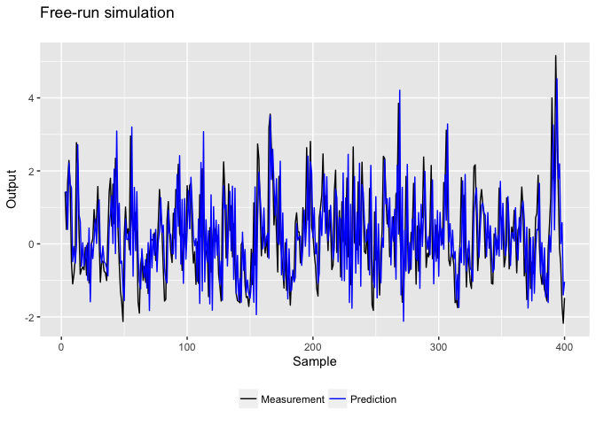
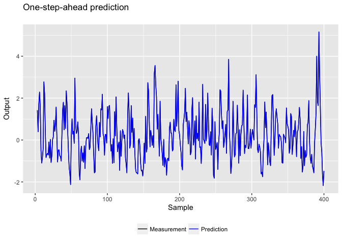
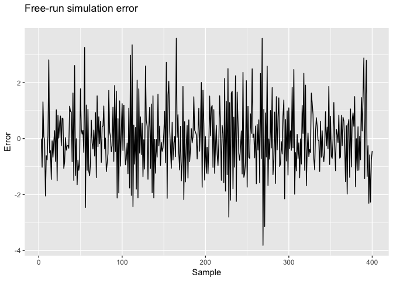
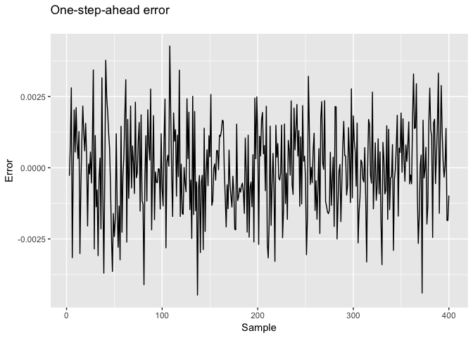
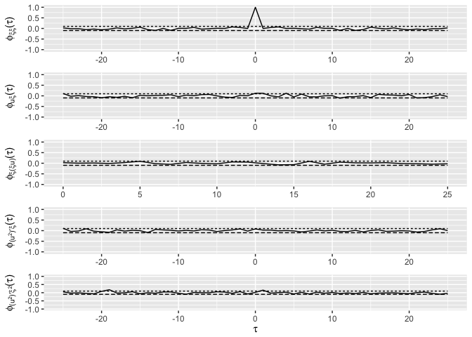

NARMAX system identification example
================
Hultmann Ayala, Helon Vicente
2018-10-05

Load libraries

``` r
library(narmax)
library(tidyverse)
set.seed(0) 
```

Generate simulation data

``` r
N = 400
u = rnorm(N, mean = 0, sd=1)
e = rnorm(N, mean = 0, sd=0.04^2)
InitE = e
y = rep(0, length(u))
for (k in 3:N) {
  y[k] = 0.5*y[k-1] + u[k-2] + 0.1*(u[k-2]^2) + 0.5*e[k-1] + 0.1*u[k-1]*e[k-2] + e[k]
}
e = rep(0,N)
```

Plot generated input-output data

Define the parameters of the model

``` r
rho_p = 1e-2
rho_n = 1.9e-6

nu = 2
ny = 2
ne = 2
nl = 2

mdl = narmax(ny, nu, ne, nl)
```

Estimate the parameters of the model

``` r
mdl = estimate(mdl, y, u, rho_p, rho_n)
print(mdl)
```

    ## narmax(ny = ny, nu = nu, ne = ne, nl = nl)
    ## 
    ##                 Term         Coefficient
    ##               u(k-2)              0.9999
    ##               y(k-1)              0.5001
    ##         u(k-2)u(k-2)              0.1000
    ##               e(k-1)              0.4924
    ##         u(k-1)e(k-2)              0.1959

Calculate the predictions of the model in OSA and FR

``` r
Ys = predict(mdl, y, u, K = 0)
```

    ## Running narmax prediction ... Done

``` r
Yp = predict(mdl, y, u, K = 1)
```

    ## Running narmax prediction ... Done

Calculate the residuals in OSA and FR

``` r
p = mdl$maxLag
time = p:N
Ep = y[p:N] - Yp
Es = y[p:N] - Ys
Up = u[p:N]
```

Store data in data frames for nice plotting

``` r
df = tibble(time,Y=y[p:N],Yp,Ys,Ep,Es) %>% gather(variable, measurement, -time)
```

FR plot (predictions)

``` r
ggplot(filter(df, variable %in% c("Y","Ys"))) +
  geom_line(aes(x = time,y = measurement,color=variable)) +
  labs(title = "Free-run simulation\n", x = "Sample", y = "Output", color = "\n") +
  scale_color_manual(labels = c("Measurement", "Prediction"), values = c("black", "blue")) +
  theme(legend.position="bottom")
```



OSA plot (predictions)

``` r
ggplot(filter(df, variable %in% c("Y","Yp"))) +
  geom_line(aes(x = time,y = measurement,color=variable)) +
  labs(title = "One-step-ahead prediction\n", x = "Sample", y = "Output", color = "\n") +
  scale_color_manual(labels = c("Measurement", "Prediction"), values = c("black", "blue")) +
  theme(legend.position="bottom")
```



Arrange FR plot (residuals)

``` r
# residuals
ggplot(filter(df, variable %in% c("Es"))) +
  geom_line(aes(x = time,y = measurement)) +
  labs(title = "Free-run simulation error\n", x = "Sample", y = "Error")
```



Arrange OSA plot (residuals)

``` r
ggplot(filter(df, variable %in% c("Ep"))) +
  geom_line(aes(x = time,y = measurement)) +
  labs(title = "One-step-ahead error\n", x = "Sample", y = "Error")
```



Arrange residuals/inputs correlation-based tests

``` r
g = xcorrel(Ep,Up)
```

Print correlation-based tests

``` r
multiplot(g$g1,g$g2,g$g3,g$g4,g$g5)
```

    ## Warning: Removed 75 rows containing missing values (geom_path).


